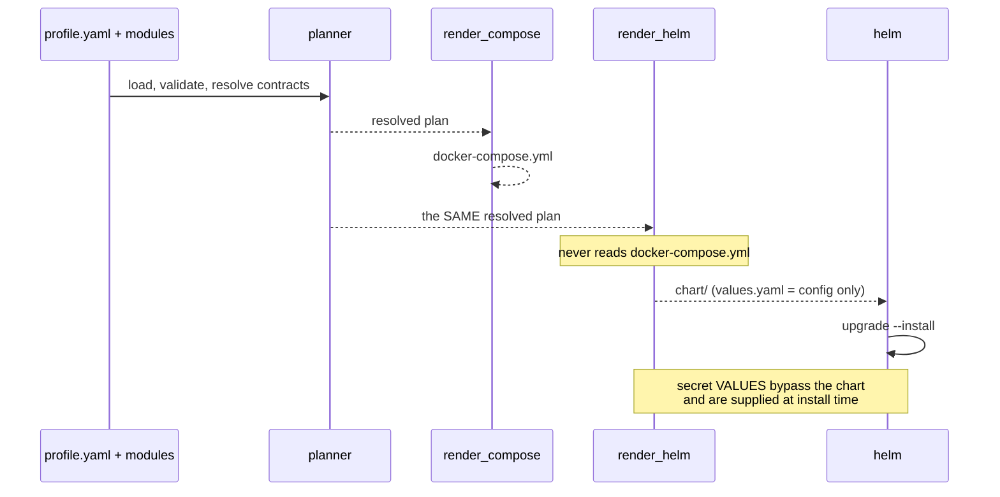

## Context

CDS resolves a profile into a plan (`apiVersion: cds/v1alpha1`) and renders that
plan to a single `docker-compose.yml`. `cli/renderer.py` is the only renderer, and
`spec.implementation.kind` already acts as a discriminator: any value other than
`docker-compose` raises `E070`.

We want CDS to also produce a Kubernetes-deployable artifact, tested on a local
k3s cluster. The question is where the Kubernetes knowledge enters the pipeline.

Two facts constrain the answer:

1. The plan is where CDS's value lives. Contract resolution, secret validation,
   dependency ordering and security checks all complete *before* the Compose file
   is written. The Compose file is a lossy projection of the plan, not a superset
   of it.
2. The Compose fragments in `modules/*/module.yaml` carry a deliberate security
   posture: `read_only`, `cap_drop: [ALL]`, `no-new-privileges`, `user`,
   `pids_limit`, `tmpfs`. This is exactly the material that generic converters
   discard.

## Decision

**CDS gains a second renderer, `cli/k8s_renderer.py`, that consumes the same
resolved plan as `render_compose()` and emits a Helm chart. It never reads the
generated `docker-compose.yml`.**

Responsibility is split along a line that follows what each format can express:

- **The Compose fragment describes the container.** Image, command, environment,
  healthcheck, tmpfs and the hardening flags are mechanically translatable, and
  the renderer translates them deterministically.
- **A new `implementation.kubernetes` block describes the orchestration shape** —
  the decisions Compose cannot express and that a converter can only guess:
  which Compose services share a Pod, whether a workload is a Deployment or a
  StatefulSet, which service is an init container, which named volume is a PVC
  rather than an `emptyDir`, which bind mount becomes a ConfigMap, resource
  requests and limits, and how the workload is exposed.

Chart shape: **CDS resolves, Helm deploys.** Config is resolved once into
`values.yaml`; templates read `.Values.*` only, so CDS placeholders and Helm
placeholders never coexist in a file. Secret *values* are never written to disk
by the renderer.

## Options considered

- **Direct plan to Helm chart** (chosen): a sibling of the Compose renderer over
  the shared plan. Keeps contract resolution, secret validation and security
  checks in one place. Costs an explicit `kubernetes` block per module.
- **Convert the rendered Compose file** (kompose, Katenary): rejected. Compose
  healthchecks do not become probes, no resource requests or limits are produced,
  `depends_on` and Compose networks have no translation, and Compose secrets map
  only loosely onto Kubernetes Secrets. Reported fidelity is roughly 70-80% with
  manual repair expected. Every one of those gaps is something the plan already
  knows and the Compose file has already thrown away.
- **A Kubernetes operator with a `CDSProfile` CRD**: deferred, not rejected. It
  contradicts the property recorded in `docs/how-it-works.md` that CDS runs
  nothing and provisions nothing, and it needs a controller image, RBAC and a
  reconciliation loop. It also layers onto a chart renderer later, whereas the
  reverse is not true, so building the renderer first forecloses nothing.
- **Plain manifests plus Kustomize**: rejected as the primary target. It offers
  no release lifecycle, and `helm upgrade --install` / `rollback` is the closest
  thing CDS has to the `apply` step it currently lacks.

## Consequences

Adding a module now means authoring two implementation blocks rather than one,
and a module with only a Compose implementation cannot be rendered for
Kubernetes. `cds validate --target=helm` reports that as an error rather than
silently emitting a degraded manifest, which is the intended trade: an explicit
gap beats a plausible-looking guess.

Both renderers consume the plan, so a change to contract resolution or secret
handling reaches both targets at once, and neither can drift into its own
resolution rules.

Some Compose semantics have no Kubernetes equivalent and are recorded as losses
rather than silently dropped: `pids_limit` (no pod-level analogue) and host port
bindings such as `127.0.0.1:5432:5432`, which become ClusterIP Services.

Re-evaluation triggers: a second non-Compose target (Nomad, ECS) would justify
promoting the translator into a shared intermediate representation rather than a
per-target renderer; and if authoring `kubernetes` blocks proves to dominate the
cost of adding a module, the derivation defaults should absorb more of it.
