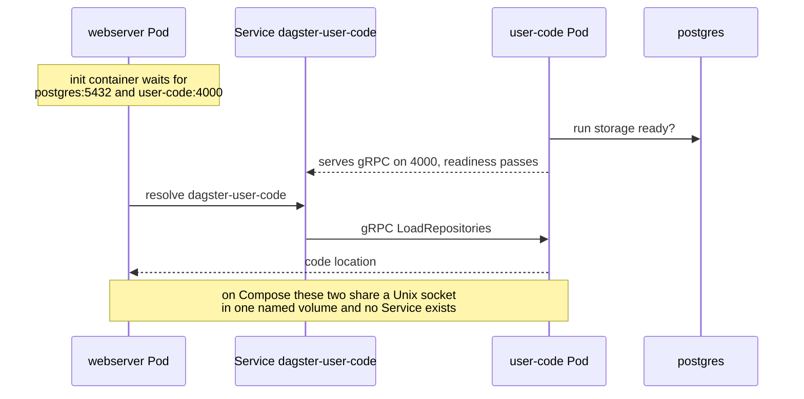

## Context

In the Compose implementation the three Dagster processes share a Unix domain
socket through a named volume:

- `user-code` runs `dagster code-server start -s /var/run/dagster/user-code.sock`
- `webserver` and `daemon` mount the same `dagster-grpc-socket` volume read-only
  and load the code location through `images/dagster/workspace.yaml`, which is
  baked into the image and points at that socket path.

A Unix socket is reachable only within a single network namespace and filesystem.
Kubernetes can reproduce this in exactly one way: put all three containers in one
Pod sharing an `emptyDir`. That works, but it makes the webserver, the daemon and
the user code a single unit of scheduling, scaling and restart, and it leaves
startup ordering unsolved, because containers in a Pod start concurrently and the
webserver reads its workspace before the socket necessarily exists.

## Decision

**On the Kubernetes target the code server listens on TCP port 4000, and each
Dagster process is its own Deployment. The webserver and daemon reach it through
a ClusterIP Service.**

The Compose implementation is unchanged and keeps the Unix socket.

Three things carry the change, all declared in `spec.implementation.kubernetes`:

- a `containerOverrides` entry replacing the `-s <socket>` argument with
  `-h 0.0.0.0 -p 4000`, and dropping the socket volume mount;
- a `configMaps` entry projecting a `workspace.yaml` that addresses the code
  server by Service DNS name instead of by socket path, mounted over the copy
  baked into the image;
- `waitFor` gates rendered as wait init containers, replacing the Compose
  `depends_on: { condition: service_healthy }` that Kubernetes has no equivalent for.

## Options considered

- **gRPC over TCP, one Deployment per process** (chosen): each process scales,
  restarts and is scheduled independently; readiness on port 4000 makes "the code
  server is up" observable to Kubernetes rather than implicit. It is also what
  Dagster's own Helm chart does, so the topology matches what Dagster users
  expect to operate. Costs a Service, a projected `workspace.yaml`, and a command
  override.
- **One Pod, three containers, shared `emptyDir`**: the smallest diff, and the
  socket path and commands stay identical. Rejected because it couples three
  independently restartable processes into one unit and leaves the webserver
  racing the socket at startup, with no Kubernetes primitive available to order
  containers within a Pod.
- **Rebuild the image with a TCP `workspace.yaml`**: would remove the ConfigMap,
  but forks the image between targets and puts a deployment-topology decision
  inside a build artifact, where the profile cannot influence it.

## Consequences

The Kubernetes and Compose topologies now differ in a way a reader must be told
about: three services on Compose become three Deployments plus one Service, and
`workspace.yaml` differs between the two. This is the first case of a module
whose Kubernetes shape is not a mechanical restatement of its Compose shape, and
it is the concrete justification for the `implementation.kubernetes` block
introduced in ADR 0001.

`dagster-io-manager-storage` was shared by all three services on Compose. Across
separate Pods that is no longer possible without ReadWriteMany storage, which the
k3s local-path provisioner does not offer, so each Deployment gets its own
`emptyDir`. This is sound for the default run launcher, which executes runs inside
the user-code container, and the webserver reads run metadata from Postgres rather
than from the IO manager. A profile that switches to an executor placing runs in
separate Pods must revisit this and supply real shared storage.

The daemon has no TCP listener, so its Compose healthcheck (a Unix socket probe)
has no Kubernetes translation and is dropped rather than replaced with a probe
that would assert something untrue. Its failure mode is a crash, which the
restart policy already covers.

Re-evaluation trigger: adopting a Kubernetes-native run launcher, which would
give runs their own Pods and change both the storage and the RBAC picture.
