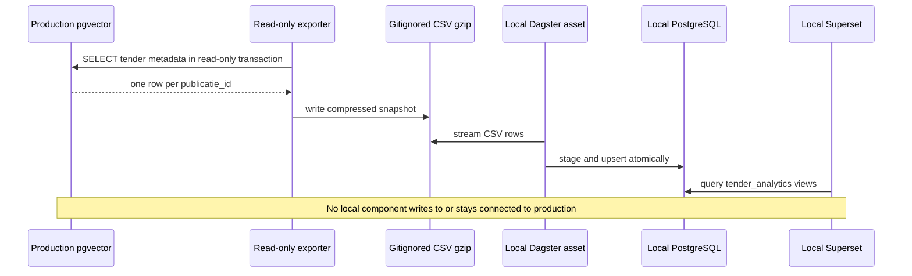

## Context

The TenderNed service referenced by `agent-swarm` is backed by a production
PostgreSQL/pgvector database. It contains about 150,000 tenders, 160,000 search
chunks, and 2.4 GB of embeddings and document text. The local CDS stack needs a
substantial analytical dataset for Dagster and Superset without turning a
developer environment into a live production consumer.

The dashboard needs tender-level metadata such as authority, publication date,
contract type, procedure, European classification, and enrichment coverage. It
does not need vector embeddings or full PDF text.

## Decision

**A read-only export creates a gitignored compressed snapshot with one row per
tender. Dagster owns the idempotent typed load into local PostgreSQL, and
Superset reads only that local analytical model.**

The snapshot contains all tender-level metadata and detail arrays, while
excluding embeddings, chunk content, and raw documents. The exporter runs a
statement-time-limited query with `default_transaction_read_only=on`. Dagster
loads through a transaction-scoped staging table and upserts on
`publicatie_id`, so rerunning the same snapshot is safe.

## Options considered

- **Local metadata snapshot** (chosen): loads the full tender population needed
  for analytics, is repeatable, and creates a hard source/target isolation
  boundary. It adds an explicit export step.
- **Live connection from local Dagster to production**: rejected because local
  experiments would depend on a tunnel and production availability, and a
  misconfigured resource could write to the source.
- **Full database dump**: rejected because embeddings and document text dominate
  the 3.2 GB database but do not serve the dashboard.
- **Sample through the search MCP API**: rejected because ranked search results
  are not a complete or stable analytical population.

## Consequences

The dashboard reflects the snapshot timestamp rather than live production.
Refreshing it is an explicit operator action. Source credentials remain inside
the source pod, and the exported file remains local and gitignored.

The local analytical table is keyed by `publicatie_id`. A refresh updates rows
present in the new snapshot but does not delete rows missing from it, which
prevents an accidentally partial snapshot from shrinking the local dataset.

Re-evaluate this decision if TenderNed publishes a stable bulk export endpoint,
if the dashboard needs document-level analytics, or if snapshot freshness
becomes an operational requirement instead of a local demonstration concern.
