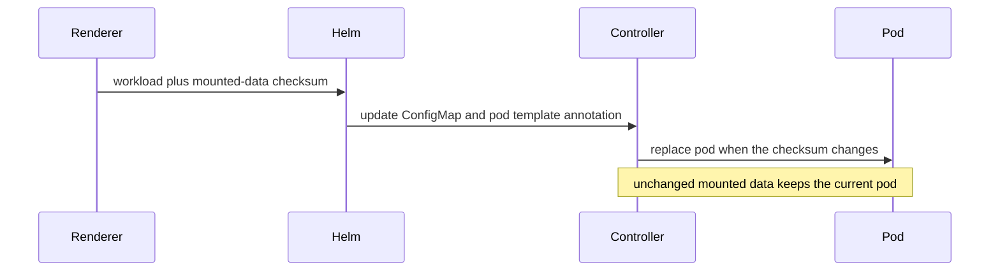

## Context

The Kubernetes renderer turns selected bind-mounted files into ConfigMaps. A
ConfigMap update does not change a workload's pod template, so a Deployment or
StatefulSet controller has no reason to create a new pod. This is especially
unsafe for `subPath` mounts because an existing pod continues to use the inode
it received at startup. Helm can report a successful upgrade while the old
application code or configuration is still running.

## Decision

**The renderer computes a deterministic SHA-256 checksum over the data of every
ConfigMap mounted by a workload and places it in the pod template annotation
`cds.dev/config-checksum`.** Only mounted ConfigMaps contribute to that
workload's checksum.

## Options considered

- **Mounted-data checksum annotation (chosen):** automatic and scoped to the
  workload that consumes the data, with a predictable rollout on content
  changes.
- **Manual rollout after every Helm upgrade:** operationally fragile because a
  successful upgrade can still leave stale code running.
- **Bake every configuration file into an image:** reliable for application
  code, but removes the renderer's existing ConfigMap workflow and requires an
  image rebuild for ordinary configuration changes.

## Consequences

Changing mounted configuration now restarts the affected Deployment or
StatefulSet. Unrelated module ConfigMaps do not restart a workload. The checksum
contains only rendered ConfigMap data, never Secret values. A configuration
change that should not restart a process must not be delivered through a
mounted ConfigMap.
