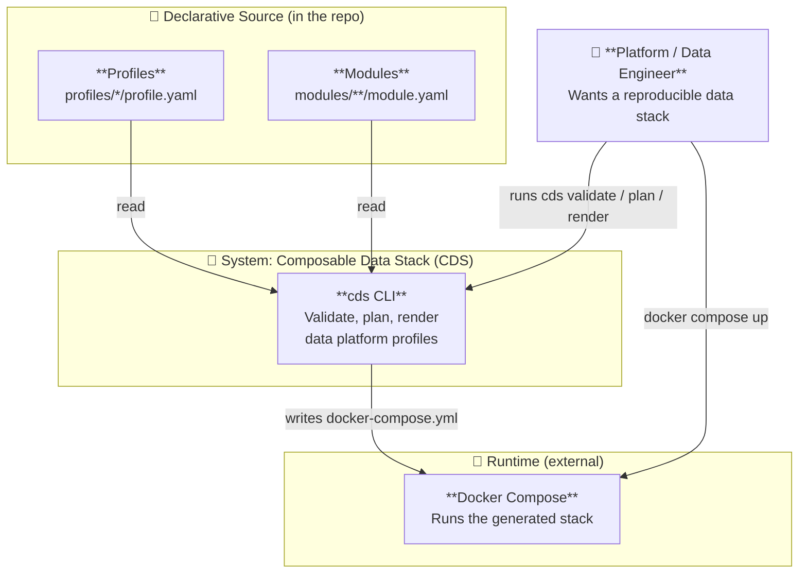
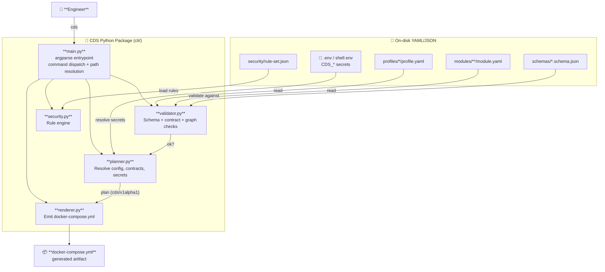
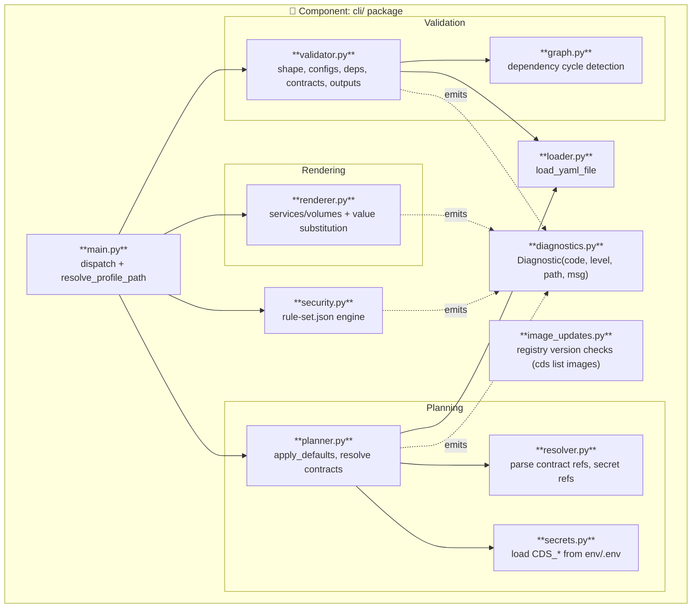
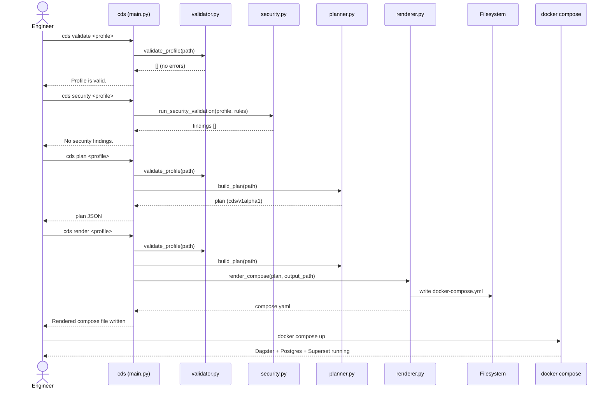
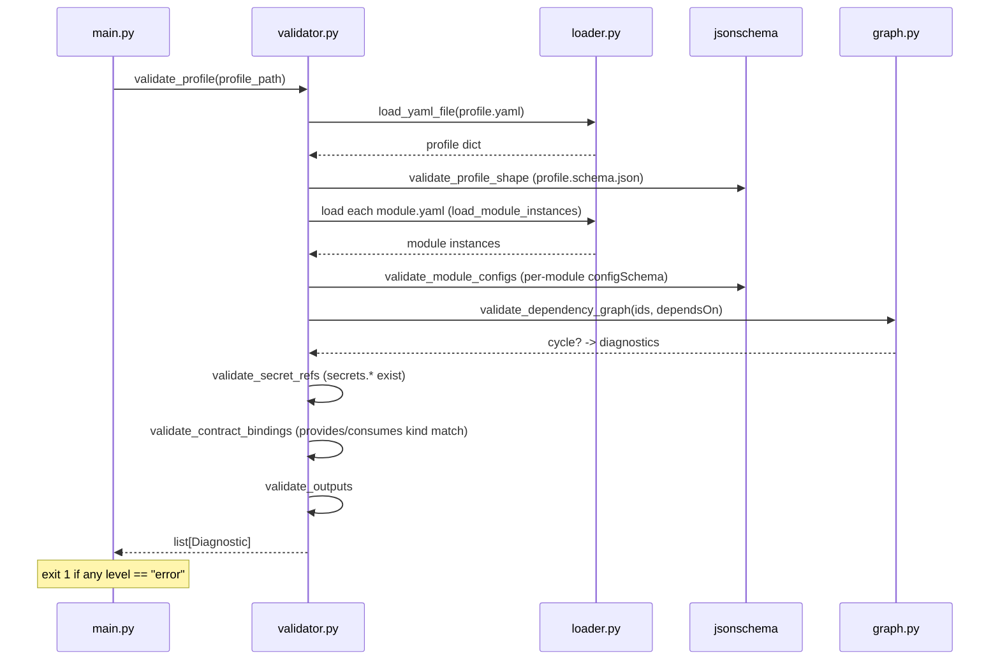
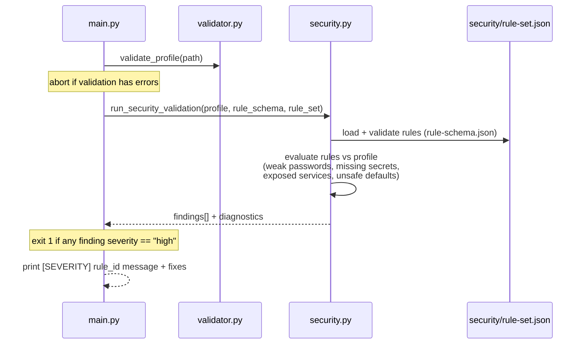
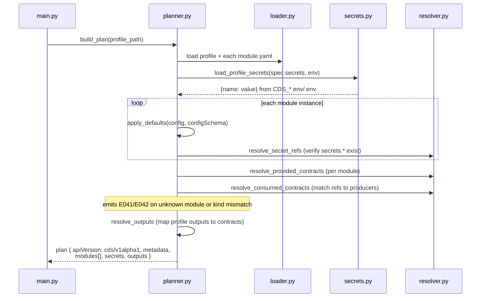
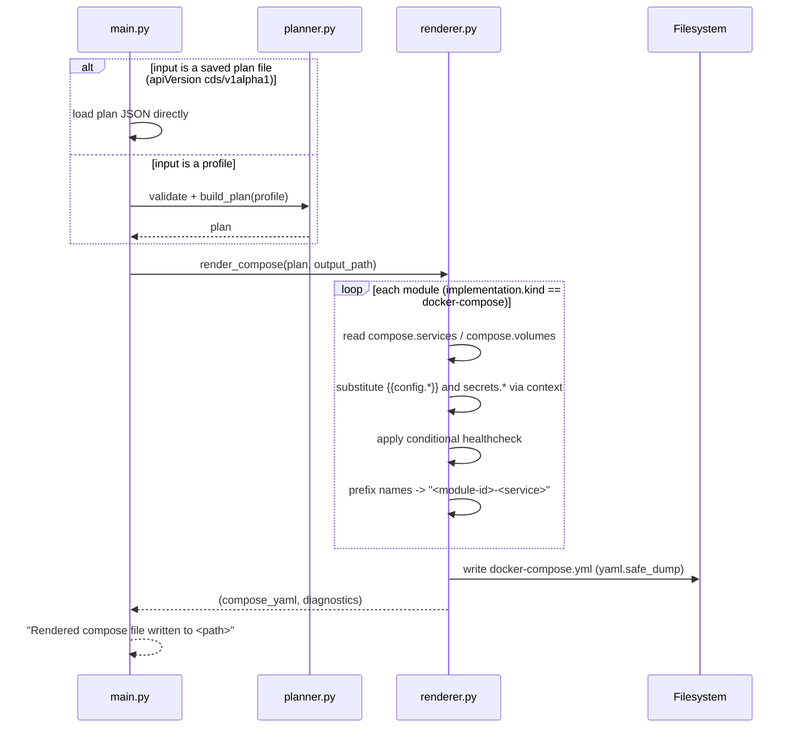

# How CDS Works

> A visual, end-to-end walkthrough of the Composable Data Stack (CDS) engine:
> what it is, what technology it uses, what it actually produces, and how each
> CLI command flows through the code.

## Table of Contents

- [TL;DR](#tldr)
- [What CDS Is (and Is Not)](#what-cds-is-and-is-not)
- [Technology and Frameworks](#technology-and-frameworks)
- [What Resources CDS Creates](#what-resources-cds-creates)
- [C4 Diagrams](#c4-diagrams)
  - [Level 1: System Context](#level-1-system-context)
  - [Level 2: Containers](#level-2-containers)
  - [Level 3: Components (the CLI internals)](#level-3-components-the-cli-internals)
- [The Domain Model](#the-domain-model)
- [Sequence Diagrams](#sequence-diagrams)
  - [End-to-End: From Profile to Running Stack](#end-to-end-from-profile-to-running-stack)
  - [`cds validate`](#cds-validate)
  - [`cds security`](#cds-security)
  - [`cds plan`](#cds-plan)
  - [`cds render`](#cds-render)
- [Anatomy of the Generated `docker-compose.yml`](#anatomy-of-the-generated-docker-composeyml)
- [Key Source Files](#key-source-files)

---

## TL;DR

CDS is a **Python command-line tool** that reads declarative **YAML** (profiles +
modules), validates them against **JSON Schemas** and a security rule set, resolves
the wiring between components ("contracts"), and **generates a `docker-compose.yml`**
you can `docker compose up`.

It is best understood as a **compiler / code generator for data platforms**:

```text
  YAML profile + YAML modules  ──▶  [ CDS CLI ]  ──▶  docker-compose.yml  ──▶  docker compose up
     (declarative source)          (validate,        (generated artifact)     (real containers)
                                    plan, render)
```

There is **no SDK, no cloud API, no Terraform provider, and no long-running
service.** CDS itself provisions nothing. It emits a Compose file; Docker does the
actual running. Think "Terraform `plan`/`render`" for a local data stack, where the
"apply" step is just `docker compose up`.

---

## What CDS Is (and Is Not)

| It **is** | It is **not** |
| --- | --- |
| A YAML-driven CLI (`cds`) | A cloud provisioner / Terraform replacement (yet) |
| A validator + planner + renderer | An orchestrator or runtime agent |
| A generator of `docker-compose.yml` | A collection of hand-written compose scripts |
| A contract-checking "compiler" | A service that stays running |
| Pure Python, two dependencies | A heavyweight framework with a plugin runtime |

The MVP shipped today covers **validate → security → plan → render**. Commands like
`cds up` and `cds test` are declared in the CLI table but are **planned**, not yet
implemented. The engine stops at generating the Compose file.

---

## Technology and Frameworks

CDS is deliberately minimal. From `pyproject.toml`:

```toml
[project]
name = "composable-data-stack"
requires-python = ">=3.11"
dependencies = [
  "PyYAML>=6.0",
  "jsonschema>=4.22.0",
]

[project.scripts]
cds = "cli.main:main"
```

| Concern | Technology | Notes |
| --- | --- | --- |
| CLI framework | **`argparse`** (stdlib) | Subcommands: `validate`, `plan`, `render`, `list`, `security`. Optional `argcomplete` for shell completion. |
| Config format | **YAML** via **PyYAML** | Everything (profiles, modules, defaults) is YAML. |
| Validation | **`jsonschema`** (Draft) | `schemas/profile.schema.json`, `schemas/module.schema.json`, plus a hand-rolled contract/graph checker. |
| Security rules | Custom engine over **JSON** | `security/rule-set.json` validated by `security/rule-schema.json`. |
| Output target | **Docker Compose** | The only implementation `kind` supported today is `docker-compose`. |
| Packaging | **setuptools** | Installs the `cds` console script. |

**No SDK.** The "interface" is the `cds` CLI plus the YAML schemas. Modules do not
import a Python API; they are pure YAML definitions the CLI reads.

The technologies you see mentioned (Dagster, Postgres, Superset, Airflow, dbt,
Vault, Superset, etc.) are **not dependencies of CDS**. They are the *tools the
generated stack runs* as Docker images. CDS only knows their Compose fragments and
contracts, declared as YAML modules under `modules/`.

---

## What Resources CDS Creates

This is the question that most often trips people up. CDS does **not** stand up
infrastructure. Running the pipeline produces exactly one durable artifact:

```text
  cds render local-dagster-postgres-superset
        │
        ▼
  ./docker-compose.yml        ← the ONLY thing CDS writes to disk
```

That generated file contains:

| Compose key | Where it comes from |
| --- | --- |
| `name:` | `profile.metadata.name` (the Compose project name) |
| `services:` | Each enabled module's `spec.implementation.compose.services`, **prefixed by module id** (e.g. `postgres-postgres`, `dagster-web`, `superset-app`) |
| `volumes:` | Each module's declared volumes, prefixed by module id (omitted if none) |
| Health checks | Rendered from each service's `healthcheck` block (conditionally enabled per config) |
| Substituted values | `{{ config.* }}` and `secrets.*` placeholders resolved against the plan's config + secrets |

Intermediate (optional) artifacts:

- **A plan** — `cds plan` emits a JSON document (`apiVersion: cds/v1alpha1`) to stdout
  or a file. This is the fully resolved, validated composition graph. `cds render`
  can consume a saved plan file directly instead of re-reading the profile.

So the honest answer to *"does it just create a bunch of composed-up scripts?"* is:
**it generates a single, deterministic Compose file from many small, contract-checked
YAML modules.** The value is in everything that happens *before* the file is written:
schema validation, contract resolution, dependency-cycle detection, and security
checks.

---

## C4 Diagrams

> Rendered as Mermaid `graph TB` (the C4 *levels* are expressed as labelled
> boundaries/subgraphs, which standard Mermaid renders reliably).

### Level 1: System Context



### Level 2: Containers

> "Container" here is the C4 sense (a runnable/deployable unit), not a Docker
> container. CDS is a single Python package; the interesting structure is inside it.



### Level 3: Components (the CLI internals)



---

## The Domain Model

Three concepts drive everything:

```text
  ┌──────────────┐        includes         ┌──────────────┐
  │   Profile    │ ──────────────────────▶ │    Module    │
  │ (a runnable  │   (by source + version) │ (one reusable│
  │  composition)│                         │  capability) │
  └──────┬───────┘                         └──────┬───────┘
         │                                        │
         │ wires modules via                      │ declares
         ▼                                        ▼
  ┌──────────────┐   provides / consumes   ┌──────────────┐
  │  Contracts   │ ◀─────────────────────▶ │  Compose     │
  │ sql-database │   (explicit interfaces) │  fragment    │
  │ http-service │                         │ (services,   │
  │ secrets-...  │                         │  volumes)    │
  └──────────────┘                         └──────────────┘
```

- A **Module** (`modules/<category>/<name>/module.yaml`) declares its `configSchema`,
  the contracts it `provides`, and its `implementation.compose` (the Docker Compose
  fragment). Categories today: `orchestration/` (Dagster), `warehouse/` (Postgres),
  `bi/` (Superset), `secrets/` (Vault).
- A **Profile** (`profiles/<name>/profile.yaml`) lists module instances with their
  `config`, `dependsOn` edges, `secrets` bindings, and `outputs`. Bindings use
  `contractRef` like `postgres.sql-database`.
- **Contracts** are the typed interfaces (`kind: sql-database`, `http-service`, …). A
  consumer's expected kind must match the producer's provided kind, or validation
  fails with `E042`.

---

## Sequence Diagrams

### End-to-End: From Profile to Running Stack

The happy path an engineer follows in the Quickstart.



### `cds validate`

Validation is the gate every other command runs first. It never touches secrets
values or generates output — it only reports `Diagnostic`s.



### `cds security`



### `cds plan`

`build_plan` is where the composition is actually resolved: defaults applied,
contracts wired, secrets located (but **not** inlined — references stay as
`secrets.*` strings).



### `cds render`

Render turns a validated plan into the Compose file. It accepts either a profile
(re-runs validate + plan) **or** a previously saved plan JSON file.



---

## Anatomy of the Generated `docker-compose.yml`

For the `local-dagster-postgres-superset` profile, render produces roughly:

```yaml
name: local-dagster-postgres-superset   # from profile.metadata.name
services:
  postgres-postgres:      # <module-id>-<service-name>
    image: postgres:16
    ports: ["5432:5432"]
    environment:
      POSTGRES_DB: analytics            # from config.database
      POSTGRES_PASSWORD: ${CDS_POSTGRES_PASSWORD}   # from secrets.postgres_password
    healthcheck: { ... }                # conditionally enabled (pg_isready)
  dagster-webserver:                    # Dagster fans out into 3 services
    build: ../images/dagster            # custom image (images/dagster/Dockerfile)
    ports: ["3000:3000"]
    depends_on: { postgres-postgres: { condition: service_healthy } }
  dagster-daemon:                       # conditionally enabled (config.daemon.enabled)
    build: ../images/dagster
  dagster-user-code:                    # user workspace (images/dagster/Dockerfile.user-code)
    build: ../images/dagster
  superset-app:
    image: apache/superset:6.1.0
    ports: ["8088:8088"]
volumes:
  postgres-data: {}                     # <module-id>-<volume-name>
```

A few things worth noting:

- **Namespacing:** every service and volume name is prefixed with its module id
  (`postgres-postgres`, `dagster-webserver`, …), so two modules can each declare a
  `web` service without colliding.
- **Fan-out:** a single module can emit multiple services. The Dagster module renders
  a webserver, an optional daemon, and a user-code service from its compose fragment.
- **Custom images:** modules may build from `images/<name>/` (e.g. the Dagster images)
  rather than pulling a public tag.
- **Substitution:** `{{ config.* }}` and `secrets.*` placeholders are resolved from
  the plan; `${CDS_*}` env references are left intact for Docker to resolve at
  `up` time.

> Note: CDS emits `name`, `services`, and (when present) `volumes`. It does **not**
> write a top-level `networks:` block — services share Docker Compose's default
> project network.

---

## Key Source Files

| File | Responsibility |
| --- | --- |
| `cli/main.py` | `argparse` entrypoint, command dispatch, profile-path + project-root resolution |
| `cli/validator.py` | Profile/module shape, config schemas, dependencies, contract bindings, outputs |
| `cli/graph.py` | Dependency-graph cycle detection |
| `cli/security.py` | Loads and evaluates `security/rule-set.json` findings |
| `cli/planner.py` | `build_plan` — apply defaults, resolve contracts + secrets, emit plan |
| `cli/resolver.py` | Parse `contractRef` and `secrets.*` references |
| `cli/secrets.py` | Load `CDS_*` secrets from environment / `.env` |
| `cli/renderer.py` | `render_compose` — plan → `docker-compose.yml` |
| `cli/loader.py` | YAML loading with diagnostics |
| `cli/diagnostics.py` | `Diagnostic` (error code, level, YAML path, message) |
| `cli/image_updates.py` | `cds list images` — check module images against registries |
| `schemas/*.schema.json` | JSON Schemas for profiles and modules |
| `security/rule-set.json` | Security rules (with `rule-schema.json` meta-schema) |
| `profiles/*/profile.yaml` | Runnable compositions |
| `modules/**/module.yaml` | Reusable capability definitions (config schema, contracts, compose fragment) |

---

*This document reflects the MVP engine: `validate → security → plan → render`.
`cds up` and `cds test` are on the roadmap but not yet implemented. See
[architecture.md](architecture.md) for the longer-term production-platform vision and
[roadmap.md](roadmap.md) for milestones.*
