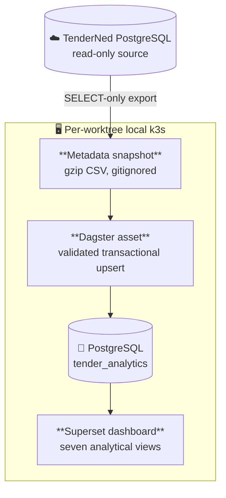

# TenderNed analytics demo

This demo moves a bounded metadata snapshot from the TenderNed database used by
the `agent-swarm` environment into the local CDS analytics warehouse. Dagster
materializes the model, and Apache Superset presents the result as a seven-chart
dashboard. The source boundary and snapshot decision are recorded in
[ADR 0003](adr/0003-tender-analytics-local-snapshot.md).

## Data flow



The snapshot contains one row per tender. It excludes embeddings, document
content, raw documents, and source credentials.

## Run the demo

Start the per-worktree cluster and install the profile first:

```bash
make k3d-up
make k3d-build
make k3d-install
```

Export, load, and visualize the TenderNed metadata:

```bash
make tender-export
make tender-load
make tender-dashboard
make tender-e2e
```

`tender-export` requires read access to the existing TenderNed Kubernetes
context. The export enforces PostgreSQL read-only mode and a two-minute query
timeout. `tender-load` validates the transferred checksum and runs the Dagster
job with a bounded timeout. Re-running both the loader and dashboard provisioner
is safe.

## Open the interfaces

Run `make k3d-env` to print the branch-specific localhost URLs. On the
`feat/k8s` branch used for this proof, they are:

- Dagster: <http://127.0.0.1:38142>
- Superset dashboard: <http://127.0.0.1:38143/superset/dashboard/tender-analytics/>

Use the local Superset administrator credentials from `.env`. No `kubectl
port-forward` process is required because the profile declares Helm-owned
NodePort Services mapped to loopback by k3d.

## Dashboard views

The provisioner creates these views from `tender_analytics.tenders_dashboard`:

- total tenders
- tenders published in the latest 30 days
- PDF-enriched tenders
- tender publications by month
- tenders by contract type
- European tender share
- top contracting authorities

## Verified local result

The September 4, 2026 snapshot loaded 149,510 distinct tenders with publication
dates from March 29, 2011 through September 4, 2026. It includes 2,752
PDF-enriched records. Two consecutive Dagster runs preserved that row count, and
two consecutive dashboard provisioning runs preserved one dashboard with seven
charts.

## Proof artifacts

- [Feature proof video](videos/tender-analytics-dashboard--feat-k8s.mp4)
- [Captured Superset dashboard](evidence/tender-analytics-dashboard.png)
- [E2E baseline at revision 3073b1c](evidence/tender-analytics-e2e-before.txt)
- [E2E green run](evidence/tender-analytics-e2e-after.txt)

The same bounded suite reported `pass=4 fail=3` when pointed at the pre-feature
revision and `pass=7 fail=0` against the completed working tree. The green run
checks the real local k3s pods, Dagster materialization, no-op convergence,
Superset object counts, seven HTTP 200 chart responses, visible dashboard
values, and an empty browser error console.
