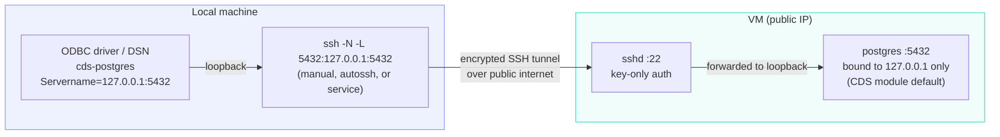

# Accessing a VM-hosted Postgres module over ODBC via SSH tunnel

This document describes a complete, secure setup for connecting to Postgres
from a local machine over ODBC, where CDS is already running the
`local-dagster-postgres-superset` profile (PoC stack: Dagster + Postgres +
Superset) on a VM reachable by a public IP address.

The `postgres` module's Compose template never declares a published host port
(`modules/warehouse/postgres/module.yaml`), so `cds security` rule
`CDS-SEC-021` (severity: high) — which matches `portExposure:
host-published` — never triggers. Rather than opening the database directly to
the internet, this setup keeps Postgres on loopback and reaches it through an
SSH tunnel — so the VM's firewall never needs a `5432` ingress rule, traffic
is encrypted, and the profile passes `cds test` with no security exceptions.

No new profile is needed for this: the profile already running on the VM
(`profiles/local-dagster-postgres-superset/profile.yaml`) already declares
the `postgres` module and its databases. This doc uses that profile as-is.

## Architecture



Source: [`docs/diagrams/architecture/vm_postgres_odbc_tunnel.mmd`](diagrams/architecture/vm_postgres_odbc_tunnel.mmd).

Only port `22` (SSH) is exposed publicly. Postgres itself stays on the VM's
loopback interface, exactly as the module renders it — this is unaffected
by which `metadata.environment` the profile runs under (`local`, or an
overlay like `--environment prod`).

## 1. Confirm what's already running on the VM

No profile changes are required for this setup. On the VM, confirm the
existing stack and its port binding:

```bash
cds plan local-dagster-postgres-superset   # sanity check the resolved config
ss -tlnp | grep 5432
# expect: 127.0.0.1:5432, NOT 0.0.0.0:5432
```

The profile's `postgres` module (`profiles/local-dagster-postgres-superset/profile.yaml`)
declares three databases sharing one Postgres instance, each with its own
credentials sourced from `.env` via `spec.secrets.values`:

| Database | Name/user env vars | Password env var (`spec.secrets.values`) |
| --- | --- | --- |
| Analytics (general use) | `CDS_ANALYTICS_DB_NAME`, `CDS_ANALYTICS_DB_USER` | `CDS_ANALYTICS_DB_PASSWORD` (`analytics_db_password` / `db_password`) |
| Dagster (internal, don't connect BI tools here) | `CDS_DAGSTER_DB_NAME`, `CDS_DAGSTER_DB_USER` | `CDS_DAGSTER_DB_PASSWORD` |
| Superset (internal, don't connect BI tools here) | `CDS_SUPERSET_DB_NAME`, `CDS_SUPERSET_DB_USER` | `CDS_SUPERSET_DB_PASSWORD` |

For ad-hoc ODBC/BI access, use the **analytics** database — the other two
back Dagster's/Superset's own internal storage. Read the actual values from
the VM's `profiles/local-dagster-postgres-superset/.env` (not committed to
git); by default `CDS_ANALYTICS_DB_NAME=analytics`,
`CDS_ANALYTICS_DB_USER=analytics`.

## 2. Harden SSH on the VM

Since SSH is now the only path to the database, lock it down:

```bash
# /etc/ssh/sshd_config
PermitRootLogin no
PasswordAuthentication no
PubkeyAuthentication yes
AllowUsers <your-ssh-user>
```

```bash
sudo systemctl restart sshd
```

Use cloud firewall/security group rules to further restrict inbound `22` to
your known IP ranges if possible.

## 3. Generate and install an SSH key (local machine)

```bash
ssh-keygen -t ed25519 -C "cds-vm-tunnel" -f ~/.ssh/cds_vm_tunnel
ssh-copy-id -i ~/.ssh/cds_vm_tunnel.pub <user>@<VM_PUBLIC_IP>
```

Add a convenience entry to `~/.ssh/config`:

```sshconfig
Host cds-vm
    HostName <VM_PUBLIC_IP>
    User <user>
    IdentityFile ~/.ssh/cds_vm_tunnel
    ServerAliveInterval 30
    ServerAliveCountMax 3
```

## 4. Open the tunnel

### Option A — manual (occasional use)

```bash
ssh -N -L 5432:127.0.0.1:5432 cds-vm
```

Leave the terminal open; `Ctrl+C` to close the tunnel.

### Option B — `autossh` (auto-reconnect, still manual start)

```bash
autossh -M 0 -N -L 5432:127.0.0.1:5432 cds-vm
```

### Option C — background service (recommended for routine/automated ODBC use)

**Linux (systemd user service):**

`~/.config/systemd/user/cds-pg-tunnel.service`:

```ini
[Unit]
Description=SSH tunnel to CDS Postgres VM
After=network-online.target
Wants=network-online.target

[Service]
ExecStart=/usr/bin/ssh -N -L 5432:127.0.0.1:5432 cds-vm
Restart=always
RestartSec=5

[Install]
WantedBy=default.target
```

```bash
systemctl --user daemon-reload
systemctl --user enable --now cds-pg-tunnel
systemctl --user status cds-pg-tunnel
```

**macOS (launchd agent):**

`~/Library/LaunchAgents/com.cds.pg-tunnel.plist`:

```xml
<?xml version="1.0" encoding="UTF-8"?>
<!DOCTYPE plist PUBLIC "-//Apple//DTD PLIST 1.0//EN"
  "http://www.apple.com/DTDs/PropertyList-1.0.dtd">
<plist version="1.0">
<dict>
  <key>Label</key>
  <string>com.cds.pg-tunnel</string>
  <key>ProgramArguments</key>
  <array>
    <string>/usr/bin/ssh</string>
    <string>-N</string>
    <string>-L</string>
    <string>5432:127.0.0.1:5432</string>
    <string>cds-vm</string>
  </array>
  <key>KeepAlive</key>
  <true/>
  <key>RunAtLoad</key>
  <true/>
</dict>
</plist>
```

```bash
launchctl load ~/Library/LaunchAgents/com.cds.pg-tunnel.plist
```

**Windows (Scheduled Task via NSSM or Task Scheduler):**

Run `ssh.exe -N -L 5432:127.0.0.1:5432 cds-vm` as a service using
[NSSM](https://nssm.cc/), or register a Scheduled Task triggered "at log on"
with the same command.

> Use a background service if a BI tool, ETL job, or application needs the
> DSN available persistently or on machine startup. For occasional manual
> querying, Option A is sufficient — don't over-engineer it.

## 5. Install the PostgreSQL ODBC driver locally

| OS | Install command |
| --- | --- |
| Debian/Ubuntu | `sudo apt install odbc-postgresql unixodbc` |
| macOS | `brew install psqlodbc unixodbc` |
| Windows | Install the [psqlODBC MSI](https://www.postgresql.org/ftp/odbc/versions/msi/) |

## 6. Register a DSN pointing at the tunnel

**`~/.odbc.ini`** (Linux/macOS, unixODBC) — point at the tunnel endpoint,
**never** the VM's public IP:

```ini
[cds-postgres]
Driver      = PostgreSQL Unicode
Servername  = 127.0.0.1
Port        = 5432
Database    = analytics
Username    = analytics
Password    = <CDS_ANALYTICS_DB_PASSWORD value from the VM's .env>
SSLmode     = prefer
```

Confirm the driver is registered in `~/.odbcinst.ini` (usually done
automatically by the package manager):

```ini
[PostgreSQL Unicode]
Description = PostgreSQL ODBC driver (Unicode)
Driver      = /usr/lib/x86_64-linux-gnu/odbc/psqlodbcw.so
```

**Windows:** ODBC Data Source Administrator → *Add* → *PostgreSQL Unicode* →
Server: `127.0.0.1`, Port: `5432`, same database/user/password.

## 7. Test the connection

```bash
isql -v cds-postgres
```

Or connect from your BI tool/application using DSN `cds-postgres`.

## What changes if you promote to the `prod` overlay

This setup currently targets the base `local-dagster-postgres-superset`
profile (`metadata.environment: local`), which is fine for a PoC. If you
later run with the `prod.yaml` environment overlay
(`cds up local-dagster-postgres-superset --environment prod`), be aware of
what changes — the tunnel/ODBC steps above stay the same either way, but
the following do not:

- **Storage size increases.** `profiles/local-dagster-postgres-superset/environments/prod.yaml` bumps the `postgres`
  module's `storage.size` from the default `5Gi` to `20Gi`. Make sure the
  VM's disk has room before switching.
- **`metadata.environment` becomes `production`**, which maps to the
  `prod` security policy class (`cli/security_common.py:ENVIRONMENT_TO_CLASS`).
  `cds security`/`cds test` then enforce stricter rules that are relaxed or
  skipped for `local`, including:
  - `CDS-SEC-004` — placeholder/default secret values (e.g. `change-me...`)
    are rejected outright, not just warned on. Rotate
    `CDS_SUPERSET_SECRET_KEY` (currently `change-me-to-a-long-random-string`
    in the sample `.env`) to a real random value before promoting, or
    `cds test` will fail.
  - `CDS-SEC-011` — required auth secrets (all four `*_password` values)
    must actually be set; missing ones fail the security stage.
  - `CDS-SEC-054` — image tags must be pinned (no `latest`/floating tags)
    outside `local`.
  - `CDS-SEC-073` — any module explicitly marked
    `metadata.productionSuitable: false` is flagged if used under `staging`
    or `prod`.
  - `CDS-SEC-022`, conversely, only applies to `local` profiles (flags
    non-local interface exposure creeping into a local profile) — it stops
    applying once you're on `prod`, since that check is local-only by
    design.
- **The Postgres port binding itself is unaffected.** The module's Compose
  template hardcodes `127.0.0.1:${config.port}:5432` regardless of
  environment, so the SSH-tunnel approach in this doc remains correct and
  required under `prod` too — nothing about promoting the environment makes
  it safe to publish the database port directly.
- Re-run `cds test local-dagster-postgres-superset --environment prod`
  after rotating secrets and before deploying, to confirm the stricter
  policy passes.

## Summary checklist

- [ ] `postgres` module deployed on the VM via a CDS profile, port bound to
      `127.0.0.1` only (default; do not change `bindAddress`/publish to
      `0.0.0.0`)
- [ ] `cds test` passes with no `CDS-SEC-021` finding
- [ ] SSH hardened: key-only auth, no root login, firewall restricted to
      known IPs where possible
- [ ] SSH key generated and installed; `~/.ssh/config` alias configured
- [ ] Tunnel running (manual, `autossh`, or a background service depending
      on how often you need access)
- [ ] ODBC driver installed locally and DSN configured against
      `127.0.0.1:5432` (the tunnel), not the VM's public IP
- [ ] Connection verified with `isql` or the consuming application

## References

- `modules/warehouse/postgres/module.yaml` — Postgres module Compose
  template and config schema
- `cli/resources/rule-set.json` — `CDS-SEC-021` (database published
  externally)
- `docs/threat-model.md` — T8 (database port exposure)
